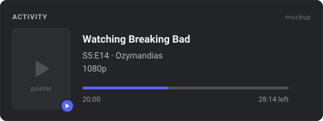

<h1 align="center">nowwatching</h1>

<p align="center">
  <b>Discord Rich Presence for whatever you are watching</b><br>
  <sub>The show's own name in the header, poster art and a live countdown.<br>Run one file and play something. No extension required.</sub>
</p>

<p align="center">
  
  
  
  <a href="LICENSE"></a>
</p>

<p align="center">
  
</p>

<!--
  ^ Placeholder mockup. To swap in a real screenshot:
      1. Start playing something, then screenshot your Discord profile card.
         Discord hides activity buttons on your OWN profile, so a second
         account or a mutual server's member list shows more.
      2. Save it as docs/preview.png
      3. Change the src above to docs/preview.png and drop the width if it
         looks small.
-->

---

## Quick start

**1. Put your Discord Application ID in `config.json`.**
[Developer Portal](https://discord.com/developers/applications) then **New
Application**. Name it anything at all, copy the **Application ID** from
*General Information*:

```json
{ "client_id": "1234567890123456789" }
```

No bot, no OAuth, no token. An Application ID is a public identifier, not a
secret.

**2. Double-click `install.cmd`.**

It registers nowwatching to start at every login and starts it straight away, so
there is nothing to remember and nothing to launch again. No admin rights: it
writes one `HKCU\...\Run` entry, the same mechanism Discord and Spotify use for
themselves.

**3. Play something.**

That is the whole setup. Presence appears within a few seconds, and keeps
appearing after every reboot.

```powershell
python nowwatching.py --status     # installed? running?
python nowwatching.py --uninstall  # or double-click uninstall.cmd
python nowwatching.py              # run in the foreground instead, to watch it
```

Standard library only, so there is nothing to `pip install`. The optional
[browser extension](#the-browser-extension) improves what gets shown on sites
that report their titles badly, but nothing above needs it.

### What it costs to leave running

Measured while idle, with nothing playing:

| | |
|---|---|
| daemon (`pythonw`) | 29 MB |
| media session helper (`powershell`) | 91 MB |
| **total** | **120 MB** |
| CPU | around 0.1% of one core |

The helper is most of that, and it is PowerShell's own baseline rather than
anything this project does: reading the media session means WinRT, which Python
cannot reach without a dependency, so a hosted PowerShell process is the price
of keeping the install dependency-free.

If that bothers you, `"source": "extension"` drops the helper entirely and runs
in about 29 MB, at the cost of needing the extension loaded and each site
enabled.

---

## The card

Most Rich Presence tools cannot help announcing themselves. The bold top line
of an activity card is normally the Discord application's name, so a tool built
around one application ID reads "Watching Netflix" or "Watching SomeTool" no
matter what is on screen.

`SET_ACTIVITY` turns out to accept a `name` field that overrides that line, so
the card can say something useful instead:

```
Watching Series                Watching Movie
Breaking Bad - S5:E14          Blade Runner 2049
Ozymandias - 1080p             2017 - 1080p
28:14 left                     1:52:07 left
```

Verified against the current Discord desktop client. `header_mode` picks what
goes on the top line:

| `header_mode` | Top line |
|---|---|
| `kind` (default) | `Series`, `Movie`, or `Video` when genuinely unknown |
| `title` | the show or film's own name |
| `app` | the Discord application's name, no override |

**Series or film is worked out, not assumed.** A season or episode number
settles it. Failing that, runtime decides: twenty to seventy-five minutes is an
episode, longer is a feature. That matters because a title on its own is usually
silent on the question, and a forty minute episode was previously being
published as `Movie`. When nothing can settle it, the header says `Video` rather
than guessing.

**When paused**, Discord is sent no timestamps at all, because it animates them
client-side and would otherwise count down over a stopped video. The position is
written into the text instead, so it is not simply lost:

```
Watching Series
Breaking Bad - S5:E14
Ozymandias - Paused at 25:00 / 40:24
```

---

## Two sources

> [!IMPORTANT]
> **The extension is not an alternative to the daemon, it is an input to it.**
> Rich Presence is a local IPC socket and a browser extension cannot open one,
> so the extension POSTs to `nowwatching.py`, which does the talking to Discord.
> Running the extension means running *both*. Nothing here lets you skip the
> background process; see [Not leaving it running](#not-leaving-it-running).

`source` in `config.json` picks where reports come from. The default, `auto`,
accepts both and prefers the extension whenever it is reporting, because it is
strictly better informed.

| | `smtc` | `extension` |
|---|---|---|
| Needs the daemon | yes | yes |
| Extra setup | none | load unpacked, grant each site |
| Idle memory | about 120 MB | about 27 MB |
| Title | whatever the site reports to Windows, sometimes just the site name | the page's own `og:title` and DOM |
| Season and episode | guessed from the title string | read from the URL, exact |
| Episode name | not available | the active episode's own label |
| Poster | looked up by name, and can mismatch | the page's own `og:image`, cannot mismatch |
| Quality | not available | `video.videoHeight` |
| Film or series | runtime and a database guess | `og:type` and the URL |
| Pause | inferred when the timeline stops moving | the real `video.paused` |
| Covers | any browser, plus VLC and anything else with a media session | only sites you enable |

The two do not produce identical cards. `smtc` needs no setup and covers
everything; `extension` is more accurate on every field it can see. That is why
`auto` prefers the extension rather than treating them as equals.

## Not leaving it running

`install.cmd` is the low-effort path, not the only one. If you would rather not
have it resident:

**Run it only when you want it.** Skip `install.cmd` entirely (or undo it with
`uninstall.cmd`) and double-click `run.cmd` when you sit down to watch
something. Close the window when you are done.

**Let it clean up after itself.** Set `idle_exit_seconds` and the daemon exits
once nothing has been playing for that long:

```json
{ "idle_exit_seconds": 600 }
```

Combined with launching it by hand, that means it is running only while it has
something to do. It defaults to `0`, meaning never exit, because that is the
right default for the autostart case.

Note that neither of these lets the extension work on its own. The extension
needs something listening on the port.

**`smtc`** reads the Windows System Media Transport Controls session. Every
Chromium tab playing video registers one, which makes it the browser-side
equivalent of mpv's IPC socket: an OS-level interface, no per-site adapters, no
permissions.

Its one real weakness is that title quality is entirely up to the site. A site
implementing the Media Session API properly reports a real title. A site that
does not gets whatever Chromium infers, which is usually the page `<title>` and
can be as useless as the bare word `Instagram`. That gap is the entire reason
the extension still exists.

---

## What it shows

| Field | Where it comes from |
|---|---|
| Title in the header | the source's title, cleaned, then `name` on the activity |
| Season and episode | the URL if the extension is running, otherwise the title |
| Episode name | the active episode's `title` attribute (extension only) |
| Year, for films | a bracketed year in the title or page text |
| Poster art | the page's `og:image`, or a TMDB or AniList lookup |
| Countdown and progress bar | the player's position and duration |
| Quality | `video.videoHeight` (extension only) |

The site you are watching on is **never published**. It is collected, because
the popup and the log need it to debug an adapter, but it stays on your machine
unless you set `show_site` to true.

---

## Poster art

The extension scrapes the page's own `og:image`, which is exact and needs no
configuration. The SMTC path only has a title, and Discord's `large_image` takes
a URL rather than bytes, so it has to look one up.

| Provider | Key | Covers |
|---|---|---|
| **TMDB** | free key | everything, and best of the four |
| **TVmaze** | none | series |
| **AniList** | none | anime |
| **Wikipedia** | none | film and series |

**No key is needed.** TVmaze and Wikipedia cover films and TV between them, so
posters work out of the box. A TMDB key in `tmdb_api_key` upgrades the matching
and the art, and is the only reason to bother.

Shipping one shared TMDB key for everybody was considered and rejected. It would
sit in a public repo for anyone to extract, all users' traffic would run under
one account, and a revocation would break the feature for every installed copy
at once. The keyless providers remove the need for one.

IMDb is absent because it has no free public API. TMDB carries IMDb IDs for
every title, so nothing is lost by going through it.

### Matching is guarded, because these searches are fuzzy

Every keyless provider here will happily answer a question you did not ask, and
each guard below exists because the unguarded version was measured getting it
wrong:

- **TVmaze** `/singlesearch/shows` returns its best fuzzy guess with no score
  and no way to reject it. It answered "Blade Runner 2049" with the series
  *Blade Runner 2099*, and every film in a test set came back looking like a
  hit. Switching to `/search/shows` gives a relevance score: real series scored
  1.19 to 1.61, films that merely fuzzy-matched scored 0.64 to 0.86, so the
  threshold sits at 1.0.
- **A show and a film can share a name.** TVmaze is right that a 1980 series
  called *Oppenheimer* exists; it is just not the 2023 film. Only the year
  separates them, so a year more than two out is rejected.
- **Wikipedia** resolves "Parasite" to *Parasitism*, the biology article, and
  would publish its illustration as poster art. Its summaries carry a
  `description` field, so a match is only accepted when that description
  actually describes a film or a series.
- **iTunes Search** was measured and dropped entirely: 3 of 8 titles, one an
  outright wrong match (*The Bear* to an unrelated bear documentary), and every
  film missed.

Which provider answers is itself useful: TVmaze and AniList hold nothing but
shows, so a hit there proves the thing is a series even when the title never
said so.

Lookups run on a background thread and are cached in `run/`, so nothing here
ever delays a presence update.

---

## Configuration

Everything lives in `config.json`, next to `nowwatching.py`. It ships working
apart from `client_id`.

| Key | Default | Meaning |
|---|---|---|
| `client_id` | *(empty)* | Discord Application ID. Required. |
| `source` | `"auto"` | `auto`, `smtc` or `extension`. See [Two sources](#two-sources). |
| `port` | `6788` | Where the bridge listens for the extension. |
| `activity_type` | `3` | 3 = Watching, 2 = Listening, 0 = Playing |
| `header_mode` | `"kind"` | What goes on the top line. See [The card](#the-card). |
| `timestamp_mode` | `"remaining"` | `remaining` gives "28:14 left" and a progress bar; `elapsed` counts up; `off` |
| `show_poster` | `true` | Use poster art as the large image |
| `show_site` | `false` | Publish the site you are watching on |
| `show_status_icon` | `false` | Small play/pause badge. Needs uploaded assets; see below. |
| `poster_lookup` | `true` | Look up posters the source could not supply |
| `tmdb_api_key` | *(empty)* | Optional. Better matching and art than the keyless providers. |
| `smtc_min_duration` | `60` | Ignore anything shorter, so a reel or an ad is not announced |
| `smtc_stall_seconds` | `10` | Treat a timeline frozen this long as paused. 0 disables. |
| `smtc_ignore_apps` | Spotify, Groove, ... | Apps whose media is listened to, not watched |
| `strip_words` | `[]` | Site names to cut out of titles. See below. |
| `idle_clear_seconds` | `40` | Clear presence after this long without a report |
| `idle_exit_seconds` | `0` | Self-exit after this long idle. 0 never exits. |
| `debug` | `false` | Also log to stderr |

`timestamp_mode: "remaining"` needs `activity_type` 2 or 3. Discord rejects an
end timestamp on other types, and losing the timestamp loses the progress bar.
With `0` (Playing), use `"elapsed"`.

### Site names in titles

Streaming sites bolt their own name onto the page title with no separator, so
"Watch The Mentalist (2008) Online Free on Movies2Watch" arrives as the only
title Windows knows. Two rules handle that automatically:

- a trailing `on <name>` or `at <name>` where the name has a digit in it
  (`Movies2Watch`) or a domain suffix (`fmovies.to`)
- a bare domain anywhere in the title

Both deliberately require the tail to look like a site rather than like English,
or real titles lose their endings: *Girl on Fire* has to survive. That means a
site whose name is a plain English word cannot be detected, so `strip_words` is
the escape hatch:

```json
{ "strip_words": ["SomePlainName", "Another Mirror"] }
```

Chromium also puts the site's own origin in the media session's `artist` field on
sites that set no metadata of their own. When it does, that string is used as a
strip word automatically, with nothing to configure.

### The play/pause badge

Unlike the poster, the small badge cannot be an external URL. Upload two images
named `playing` and `paused` under **Rich Presence, Art Assets** on your Discord
application, then set `"show_status_icon": true`.

---

## The browser extension

Optional. It exists to fix the sites SMTC reports badly, and to add the exact
poster, the URL-derived season and episode, and the quality readout.

Go to `chrome://extensions`, switch on **Developer mode**, click **Load
unpacked**, and pick the `extension/` folder. Then open a streaming site, click
the toolbar icon, and press **Enable**.

### How it works

```
      top frame                   player iframe (cross-origin)
   title, season, ep                position, duration, paused
          |                                    |
          +------------- content script -------+
                              |
                     background.js  (merges by tabId)
                              |
                     POST 127.0.0.1:6788
                              |
                      nowwatching.py  <---- smtc.ps1 (the other source)
                              |
                      Discord IPC socket
```

Two decisions carry most of the weight.

**Adapters match structure, not hostnames.** Streaming mirrors rotate domains
constantly, so a hardcoded domain list would need an update every time a new one
appears. `detect()` fingerprints the markup instead, so a fresh mirror of a
template the code already knows works on day one. The sflix, fmovies and
movies2watch family are reskins of a single template, which is why one adapter
covers dozens of domains.

**The video and the metadata live in different frames.** The title is in the top
frame while the actual `<video>` sits inside a third-party player iframe on
another origin. Neither frame can read the other, so each reports independently
and the service worker joins them by tab. This is why most homemade attempts
show a title but never a progress bar.

### Permissions

The extension installs asking for **no site access**. Nothing is declared in the
manifest; content scripts are registered at runtime as you grant domains.

**Enable (per site)** grants one domain, enough for title, season, episode and
poster.

**Read player frames (all sites)** is needed to reach a `<video>` inside a
third-party player iframe, because that frame is a different origin and cannot be
granted individually. The collector asks the service worker for a role before
reading anything, and the worker only assigns one if the **top** frame of that
tab is a site you enabled. Switch it off and the grant is handed back.

The bridge listens on `127.0.0.1` only and checks the `Origin` header on reads as
well as writes: browsers always attach one to a cross-origin request and a page
cannot forge it, so an ordinary web page can neither drive your presence nor read
what you are watching.

### Adding a site

Open the popup and press **Inspect page** to see exactly what the adapters saw:

```json
{ "frame": "top", "adapter": "generic", "meta": {
    "title": "Some Show", "kind": "series", "season": null, "episode": 3 },
  "hasPlayer": true, "videoCount": 1 }
```

If `generic` already gets it right there is nothing to add. It reads OpenGraph
tags plus the URL, which most streaming sites populate correctly because they
want link previews to work.

If not, copy the `sflix-family` block in
[`extension/src/adapters.js`](extension/src/adapters.js), change `detect()` to
fingerprint the markup you see, and return whatever `read()` can find. Every
field except `title` is optional and the bridge range-checks all of it, so a
wrong guess degrades rather than breaks. Reload the extension to pick up changes.

---

## Status

**Verified end to end** against a live Discord desktop client: the `name` header
override, external-URL poster art, the start and end timestamp pair that draws
the countdown, all four payload layouts, and the Origin checks. The SMTC helper
was confirmed reporting real title, position, duration and playback status from a
live browser tab, and its Python side has a deterministic test covering
extrapolation, the duration floor, the app filter and staleness.

**Not yet verified:** the browser extension has never been loaded in a browser.
It is syntax-checked but no live page has been parsed by it, and the
`sflix-family` selectors in particular are best effort, written as candidate
lists because that template gets forked and lightly renamed. **Inspect page**
exists so a broken selector takes minutes to fix. Reports of what actually
happened on a given site are the most useful contribution right now.

---

## Troubleshooting

Check `run/nowwatching.log` first. A healthy session shows one `presence:` line
per real change, not a steady stream.

```
21:14:02 daemon: start on 127.0.0.1:6788
21:14:02 smtc: helper started
21:14:09 discord: connected via \\.\pipe\discord-ipc-0
21:14:09 presence: Breaking Bad | S5:E14 - Ozymandias | 1080p  [smtc:MSEdge]
```

The trailing bracket names the source, so you can always tell which half
produced a card.

<details>
<summary><b>Is it the browser half or the Discord half?</b></summary>

```powershell
python nowwatching.py --test
```

Publishes one sample card with no browser involved. If that shows up, your
`client_id` and Discord are fine and the problem is upstream of them.

```powershell
python nowwatching.py --dry-run
```

Prints each payload instead of publishing, and runs alongside the real bridge.

```powershell
python smtc.py
```

Prints the media session as the daemon sees it, once a second. If this says
`(nothing)` while a video plays, the site is not registering a session and only
the extension can help.
</details>

<details>
<summary><b>Nothing shows up at all</b></summary>

Discord must be the **desktop app** and already running. Then check
`Settings, Activity Privacy, Share your detected activities` is on.
</details>

<details>
<summary><b>It says "Watching Instagram", or some other site name</b></summary>

That site reports no Media Session metadata, so Windows only knows the page
title. Nothing on the SMTC side can recover a real title from that. Load the
extension and enable that site.
</details>

<details>
<summary><b>Short clips and ads keep appearing</b></summary>

Raise `smtc_min_duration`. It defaults to 60 seconds, which filters reels and
most pre-rolls but not a long ad break.
</details>

<details>
<summary><b>The countdown keeps running after I pause</b></summary>

Some players never update their media session status when you pause, especially
once the tab is no longer in the foreground. The reported position freezes but
the status still claims to be playing, so Discord animates a countdown that has
nothing to do with what is on screen.

A timeline that has not moved for `smtc_stall_seconds` (10 by default) is
therefore treated as paused. Lower it if pauses take too long to register, and
check `run/nowwatching.log` for the line about the timeline having stopped
moving.
</details>

<details>
<summary><b>The site's name is stuck in the title</b></summary>

Add it to `strip_words`. The automatic rules only fire on a tail that looks like
a site, because anything looser eats real titles. See
[Site names in titles](#site-names-in-titles).
</details>

<details>
<summary><b>Wrong poster, or a poster for something else entirely</b></summary>

The keyless providers all search fuzzily, and the guards described in
[Poster art](#poster-art) reject what they can. A title with no year is the hard
case, since a series and a film sharing a name can then only be told apart by
which database answered. Add `tmdb_api_key` for better matching, or load the
extension, which takes the poster straight off the page and cannot mismatch.
</details>

<details>
<summary><b>Music shows up as something I am "watching"</b></summary>

Add the app to `smtc_ignore_apps`. Spotify and Groove are filtered by default.
</details>

<details>
<summary><b>The title shows but there is no countdown</b></summary>

On the extension path, the player is in a cross-origin iframe so the `<video>`
is out of reach. Turn on **Read player frames** and reload the page.
</details>

<details>
<summary><b>"port 6788 is busy"</b></summary>

Another copy is already running, which after `install.cmd` is the normal state.
The port is deliberately the single-instance lock, so the second copy exiting is
it working correctly. `--status` will confirm. Change `port` in `config.json`
(and in the popup) if something unrelated wants it.
</details>

<details>
<summary><b>It stopped starting at login</b></summary>

Check `python nowwatching.py --status`. If the autostart line points at a path
that no longer exists, you moved the folder: re-run `install.cmd` to repoint it.
`--status` says so explicitly when the recorded command and the current one
disagree.

Windows also disables startup entries from Task Manager's Startup tab, and
nothing here can tell that has happened, so check there too.
</details>

<details>
<summary><b>I want it running but not at login</b></summary>

`uninstall.cmd` removes the login entry without touching anything else. Then
launch it yourself whenever you want, with `run.cmd` or
`python nowwatching.py`.
</details>

---

## Linux and macOS

The SMTC source is Windows only: it is a WinRT API with no equivalent elsewhere.
The bridge and the extension are both portable, so `"source": "extension"` works
anywhere, and the bridge already accepts `moz-extension://` origins. MPRIS would
be the Linux analogue of `smtc.ps1` and is not written. If you want it, that is
the most useful thing to contribute.

---

## Acknowledgements

The Discord IPC layer is shared with
[anicli-rpc](https://github.com/KernelSpecter/anicli-rpc), which does this job
for [ani-cli](https://github.com/pystardust/ani-cli) and mpv. If you watch anime
from a terminal, use that one instead. The comment on `bytes_available` in both
projects explains the one Windows detail that makes any of this work.

Metadata from [TMDB](https://www.themoviedb.org) and
[AniList](https://anilist.co). This product uses the TMDB API but is not
endorsed or certified by TMDB.

MIT licensed. See [LICENSE](LICENSE).
